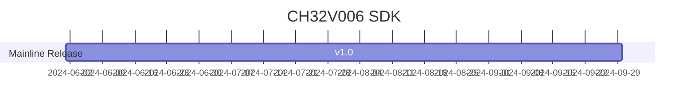

# [CH32V006](https://github.com/SoCXin/CH32V006)

* [WCH](http://www.wch.cn/)：[RISC-V](https://github.com/SoCXin/RISC-V)
* [L1R3](https://github.com/SoCXin/Level): 48 MHz 

## [简介](https://github.com/SoCXin/CH32V006/wiki)

[CH32V006](https://www.wch.cn/products/CH32V006.html) 是基于青稞RISC-V内核设计的工业级通用微控制器，支持48MHz系统主频，具有宽压、低功耗、单双线调试等特点。CH32V006内置1组12位模数转换ADC，采样率高达3Msps；内置OPA运放，支持高速模式以提高压摆率，其P端支持3通道轮询；提供了7路DMA控制器、8路TouchKey、多组定时器、2组USART串口、I2C、SPI等丰富外设资源。

### 关键特性

* 48MHz RISC-V2C
* 8KB SRAM + 62KB Flash
* 1组运放OPA/PGA/电压比较器，支持高速模式以提高压摆率
* 1组7路通用DMA控制器
* 1组12位ADC
* 1个16位高级定时器、1个16位通用定时器和1个16位精简定时器
* 多引脚映射的UART串口，I2C接口，SPI接口
* 2个看门狗定时器和1个32位系统时基定时器
* 2组USART接口、1个IIC接口、1个SPI接口
* 31个I/O口，映射1个外部中断
* 封装：QFN32、QSOP24、QFN20、TSSOP20
* 供电：2.5/3.3/5V

## [资源收录](https://github.com/SoCXin)

* [参考资源](src/)
* [参考文档](docs/)
* [参考工程](project/)
* [mounriver开发环境](http://www.mounriver.com/download)

## [选型建议](https://github.com/SoCXin)

[CH32V006](https://github.com/SoCXin/CH32V006) 
