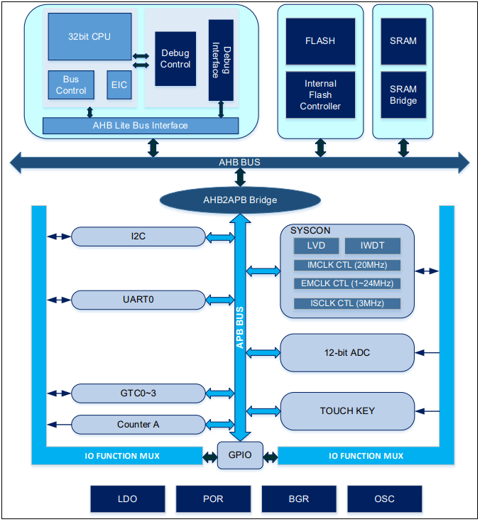

# [APT32F003](https://github.com/SoCXin/APT32F003)

#### [Vendor](https://github.com/SoCXin/Vendor) ：[APT](http://www.aptchip.com/)
#### [Core](https://github.com/SoCXin/RISC)：[C-Sky](https://github.com/SoCXin/RISC)
#### [Level](https://github.com/SoCXin/Level) ：20 MHz * 0.9 DMIPS/MHz

## [简介](https://github.com/SoCXin/APT32F003/wiki)

[APT32F003](https://github.com/SoCXin/APT32F003)集成了中天微系统开发的32位RISC内核，最高工作频率20MHz，内嵌FLASH和SRAM存储器（最大36KB FLASH，2KB SRAM），芯片提供多种丰富的外设和IO口。全系统产品提供的通讯接口包括I2C，UART，内嵌的12位ADC可以支持最大14路AD采样输入，提供4个16位的TIMER和1个32位的TIMER，其中4个TIMER可以支持PWM功能。

APT32F003 提供一种20脚封装形式，工作电压为2.4~5.5V，支持多种工作模式以实现不同要求下的功耗需求。这些丰富的特性使得APT32F003单片机非常适合应用于小型控制应用，人机接口，手持设备等。

#### 关键特性

* ADC
### [资源收录](https://github.com/SoCXin/APT32F003)

* [参考文档](docs/)
* [参考资源](src/)
* [参考工程](project/)

### [选型建议](https://github.com/SoCXin)

[APT32F003](https://github.com/SoCXin/APT32F003)

###  [www.SoC.xin(芯)](http://www.SoC.Xin)
